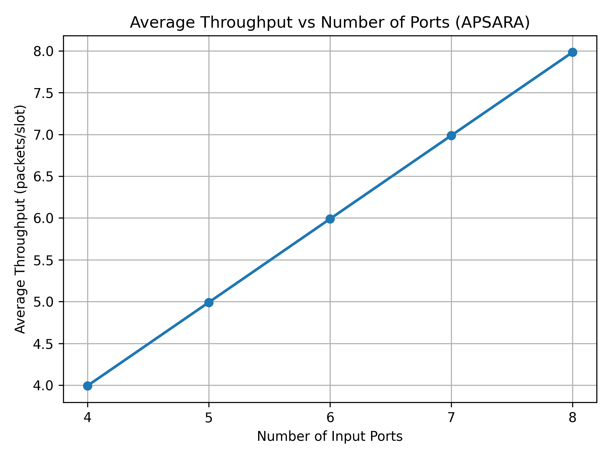
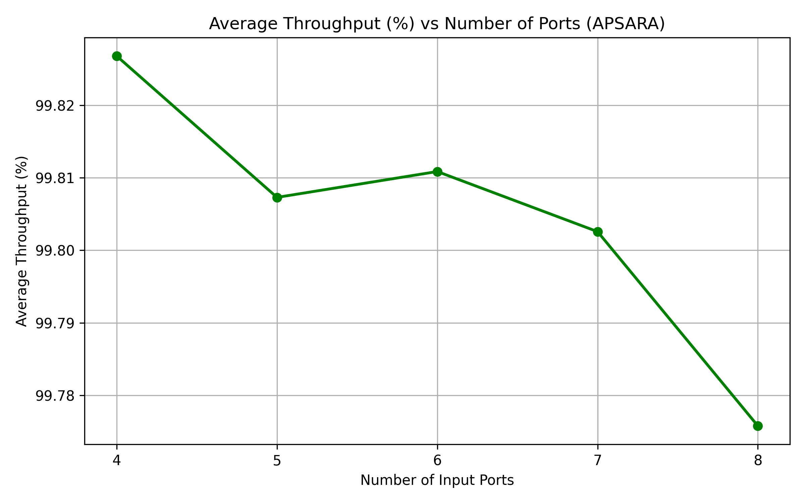

# 🧠 Implementation and Evaluation of APSARA
> Developed for the *Architecture of Network Devices* course under the supervision of **Dr. Masoud Sabaei**,  
> *Amirkabir University of Technology (AUT), 2025–2026.*
---
## 📑 Table of Contents
1. [📘 Introduction](#introduction)
2. [🖧 System Model](#system-model)
3. [🔁 APSARA Scheduling Algorithm](#apsara-scheduling-algorithm)
7. [▶️ Build and Execution](#build-and-execution)
8. [📚 References](#references)

---

<a id="introduction"></a>
## 📘 Introduction

### 🌐 Background
Packet switches and routers are fundamental components of modern communication networks. While routers operate at the network layer to forward packets across networks, switches typically operate at the data link layer to forward packets within a network. Despite this distinction, both rely on an internal **switching fabric** to resolve contention among packets destined for shared outputs.

### 🖧 Input-Queued Switching
High-speed switches commonly adopt the **input-queued architecture**, where packets are buffered at input ports. To overcome **Head-of-Line (HOL) blocking**, **Virtual Output Queues (VOQs)** are employed, assigning a separate queue at each input for every output port.

### 🔁 Scheduling Challenge
At each time slot, the switch must compute a **matching** between inputs and outputs. This **switch scheduling** problem directly determines the throughput and delay performance of the system.

### 🧠 APSARA Motivation
While **Maximum Weight Matching (MWM)** is throughput-optimal, its computational complexity makes it impractical for large switches. **APSARA** addresses this challenge by approximating MWM using local search and structured traversal of the matching space, achieving high throughput with reduced complexity.

[Back to Top](#-table-of-contents)

---

<a id="system-model"></a>
## 🖧 System Model

- **N × N input-queued switch**
- **Virtual Output Queues (VOQs)** at each input
- **Infinite buffers**
- **Slotted time**
- In each time slot:
  - One packet arrives at every input
  - Destination is chosen uniformly at random
- Packets are abstracted as **integer queue counters**

This configuration represents a **saturated traffic regime**, commonly used to evaluate throughput optimality.

[Back to Top](#-table-of-contents)

---
<a id="apsara-scheduling-algorithm"></a>
## 🔁 APSARA Scheduling Algorithm

APSARA operates in discrete time slots and executes a three-phase scheduling procedure designed to select efficient input–output matchings with low computational complexity.

### 📥 Arrival Phase
At the beginning of each time slot, exactly one packet arrives at every input port and is placed into the appropriate Virtual Output Queue (VOQ) according to its destination.

### 🔍 Matching Selection Phase
The core scheduling decision is performed in this phase. Starting from the matching selected in the previous time slot, APSARA evaluates a limited set of candidate matchings using the following strategy:

- A local search is carried out over swap-based neighboring matchings derived from the current matching.
- An additional candidate matching generated via a Hamiltonian-style cyclic permutation is examined to ensure exploration of the matching space.
- Among all evaluated candidates, the matching that serves the largest number of backlogged queues is selected.

This selection criterion approximates the objective of throughput-optimal scheduling while avoiding the high computational cost of global optimization.

### 🚚 Service Phase
Once the matching is selected, the switch transmits at most one packet on each chosen input–output connection. If the corresponding Virtual Output Queue is empty, no transmission occurs on that connection during the current time slot.


[Back to Top](#-table-of-contents)

---

## 📊 Throughput Definition

- **Instantaneous throughput** refers to the number of packets successfully transmitted from input ports to output ports within a single time slot.

- **Average throughput** is defined as the mean number of packets transmitted per time slot over the entire simulation duration.

- **Normalized throughput** represents the ratio of the average throughput to the maximum possible throughput of the switch (i.e., the number of input/output ports).  
  This metric takes values between 0 and 1 and enables fair comparison of throughput performance across switches of different sizes.


[Back to Top](#-table-of-contents)

---

## 🧪 Simulation Setup

- Ports: **4 to 8**
- Time slots: **131913**
- Initial matching: identity permutation
- Traffic: saturated uniform arrivals
- Buffers: infinite

[Back to Top](#-table-of-contents)

---
## 📈 Results and Analysis

The performance of the APSARA scheduling algorithm was evaluated under saturated traffic conditions. The numerical results obtained from the simulations are summarized and visualized below.

---

### 📊 Average Throughput (Packets per Slot)


This figure shows the average number of packets successfully transmitted per time slot as a function of the number of switch ports.

---

### 📉 Normalized Throughput


The normalized throughput represents the fraction of the maximum achievable throughput and highlights the scalability of APSARA as the switch size increases.

---

### 📄 Tabulated Results (Normalized Throughput)

| Number of Ports | Normalized Throughput |
|-----------------|-----------------------|
| 4               | 0.99826780            |
| 5               | 0.99807297            |
| 6               | 0.99810860            |
| 7               | 0.99802576            |
| 8               | 0.99775799            |

The table reports the normalized throughput values obtained from the simulation with full numerical precision. Normalized throughput represents the fraction of the maximum achievable switching capacity that is utilized by the scheduler. The results show that APSARA maintains throughput values very close to one for all switch sizes, with a slight monotonic decrease as the number of ports increases.

<a id="build-and-execution"></a>
<a id="build-and-execution"></a>
## ▶️ Build and Execution

This section describes how to download the repository, build the APSARA scheduler, run the simulations, and reproduce the reported results.

---

### 📥 Clone the Repository
First, clone the repository from GitHub and navigate to the project directory:

```bash
git clone https://github.com/salirezaeb/APSARA-Matcher.git
cd APSARA-Matcher
```
### ⚙️ Build the APSARA Scheduler

The APSARA scheduler is implemented in C++ using the C++17 standard. Compile the code using the following command:
```
g++ -O2 -std=c++17 APSARA.cpp -o apsara_switch
```
### ▶️ Run the Simulation

Execute the compiled program:
```
./apsara_switch
```

A menu will be displayed. Select one of the following options:

- **Option 1** — Run a custom simulation (user-defined number of ports and time slots)
- **Option 2** — Reproduce the evaluation for switch sizes **4 to 8** using **131913** time slots

### 📊 Generate Throughput Plots 

After the C++ simulation finishes, a CSV file named `throughput_vs_ports.csv` will be available in the project directory. Use the Python script to generate the plots:

```bash
python3 Comparison.py
```


<a id="references"></a>
## 📚 References

1. N. McKeown, A. Mekkittikul, V. Anantharam, and J. Walrand,  
   *Achieving 100% Throughput in an Input-Queued Switch*,  
   IEEE Transactions on Communications, vol. 47, no. 8, pp. 1260–1267, 1999.

2. C.-S. Chang,  
   *Performance Guarantees in Communication Networks*,  
   Springer, 2000.

3. Reference Textbook,  
   **APSARA Scheduling Algorithm**, p. 251.

4. D. Shah and J. N. Tsitsiklis,  
   *Scheduling in Input-Queued Switches*,  
   Queueing Systems, vol. 50, no. 2–3, pp. 235–258, 2005.

5. M. Marsan, P. Giaccone, E. Leonardi, and F. Neri,  
   *High-Performance Packet Switching*,  
   Springer, 2003.
